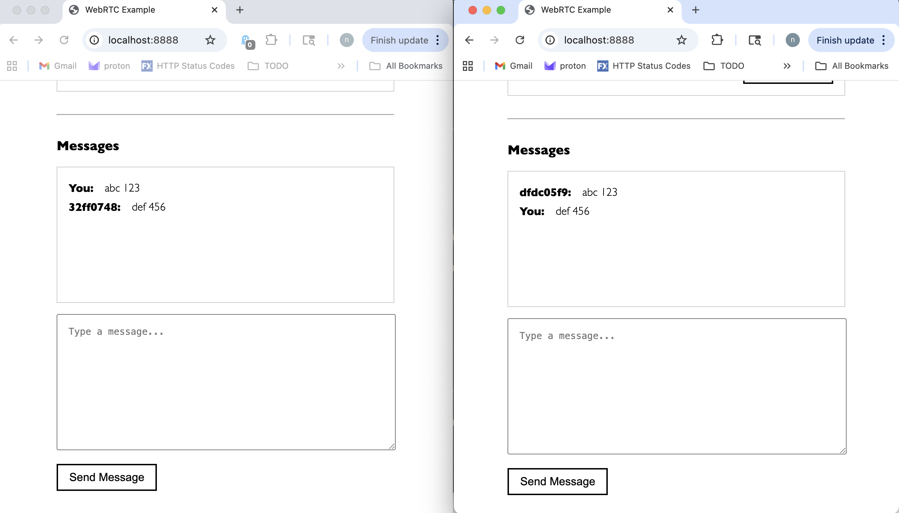

# webrtc

[](https://github.com/substrate-system/webrtc/actions/workflows/nodejs.yml)
[](README.md)
[](https://semver.org/)
[](./CHANGELOG.md)
[](https://packagephobia.com/result?p=@substrate-system/webrtc)
[](https://bundlephobia.com/package/@substrate-system/webrtc)
[](LICENSE)


Simple peer-to-peer connections. Use this module to simplify
[webrtc data channel connections](https://developer.mozilla.org/en-US/docs/Web/API/WebRTC_API/Using_data_channels).
This combines signaling events with webrtc events, because in practice, you
only need to know a few things for peer connections &mdash; did we connect to a
peer? which peers exist? and did we get a new message?

> [!WARNING]  
> WIP status.

<details><summary><h2>Contents</h2></summary>

<!-- toc -->

- [Install](#install)
- [Get Started](#get-started)
  * [Websocket Server](#websocket-server)
  * [Client Example](#client-example)
- [API](#api)
  * [Client-Side](#client-side)
    + [`connect`](#connect)
    + [Events](#events)
      - [`peerlist`](#peerlist)
      - [`socket`](#socket)
      - [`message`](#message)
      - [`datachannel`](#datachannel)
      - [`peer`](#peer)
      - [`peer-disconnect`](#peer-disconnect)
      - [`webrtc-close`](#webrtc-close)
- [Security](#security)
  * [End-to-End Encryption](#end-to-end-encryption)
  * [What the Signaling Server Can See](#what-the-signaling-server-can-see)
  * [What the TURN Server Can See](#what-the-turn-server-can-see)
  * [Summary](#summary)
- [Modules](#modules)
  * [ESM](#esm)
  * [Common JS](#common-js)
  * [pre-built JS](#pre-built-js)
    + [copy](#copy)
    + [HTML](#html)
- [Develop](#develop)
  * [Deploy](#deploy)
  * [`.env` file](#env-file)
- [Perfect Negotiation](#perfect-negotiation)
- [See Also](#see-also)

<!-- tocstop -->

</details>

[You can use the example app here](https://substrate-system.github.io/webrtc/).



## Install

```sh
npm i -S @substrate-system/webrtc
```

## Get Started

### Logs

We use [@substrate-system/debug](https://github.com/substrate-system/debug) for
logging. In the browser, you can set the key `DEBUG` to `webrtc` to enable
logging in the browser.

```js
window.localStorage.setItem('DEBUG', 'webrtc')
```

### Servers

You need 2 things: a [Partykit server](https://www.partykit.io/) and a
[TURN server](https://webrtc.org/getting-started/turn-server). The good news
is that both of these are easy & free to use.

For the TURN server, I recommend [Cloudflare's service](https://developers.cloudflare.com/realtime/turn/).
It is easy to setup and free for demonstration purposes.

If you want to run the example app locally, you will need to create a .env file
following the example in [.env.example](./.env.example). Replace the
variables with your own Cloudflare credentials.

### Websocket Server

In [your Partykit project](https://docs.partykit.io/quickstart/),
create a server that inherits from the `/server` path here. This is a
[signaling server](https://developer.mozilla.org/en-US/docs/Web/API/WebRTC_API/Signaling_and_video_calling#the_signaling_server).

See [./example_backend](./example_backend/).

```ts
import type * as Party from 'partykit/server'
import Server, { defaultHeaders } from '@substrate-system/webtrc/server'

export default class PartyServer extends Server {
    async onRequest (req:Party.Request):Promise<Response> {
        const res = await super.onRequest(req)

        // example: set the headers in response
        return new Response(res.body, {
            status: res.status,
            statusText: res.statusText,
            headers: defaultHeaders()
        })
    }
}

Server satisfies Party.Worker
```

### Client Example

This is the browser-side code.

```ts
import { type Connection, connect } from '@substrate-system/webrtc'
import Debug from '@substrate-system/debug'
const debug = Debug(true)

const connection = await connect({
    host: PARTYKIT_HOST,
    room: 'example'
})

// now we are connected to the websocket server,
// because we awaited the connection

connection.on('message', ev => {
    debug('message event', ev)
})

connection.on('peerlist', list => {
    debug('peerlist event', list)
})

connection.on('peer', ([peerId, dc]) => {
    // now we are connected to a peer
    debug('peer', peerId)
    debug('data channel', dc)
})

connection.on('message', ev => {
    debug('got a message from peer', ev.peer)
    debug('the message content', ev.data)
})

connection.on('peerlist', list => {
    debug('the list of peers connected to the websocket:', list)
})

connection.on('peer', ([peerId, _dc]:[string, RTCDataChannel]) => {
    // when a connection is established to a peer
    debug('new peer connection', peerId)
})
```


## API

### Client-Side

#### `connect`

```ts
export function connect ({
    host,
    room
}:{ host:string; room:string; }):Promise<Connection>
```

Create a websocket connection to the given host.

#### Events

##### `peerlist`

```ts
peerlist:(peers:string[]) => void
```

Emitted when you first connect to the websocket server with a list of peer
IDs currently in the room.

**Parameters:** `peers: string[]`

##### `socket`

```ts
socket:(ws:PartySocket)=>void
```

Emitted when the websocket connection is established.

**Parameters:** `ws: PartySocket`

##### `message`

```ts
message:(ev:{ data:string, peer:string })=>void|Promise<void>
```

Emitted when a message is received from a connected peer. Includes the
message data and the sender's peer ID.

**Parameters:** `{ data: string, peer: string }`


##### `datachannel`

```ts
datachannel:(dc:RTCDataChannel)=>void
```

Emitted when a WebRTC data channel connection is established.

**Parameters:** `dc: RTCDataChannel`

##### `peer`

```ts
peer:(arg:[string, RTCDataChannel])=>void
```

Emitted when a peer is successfully connected via WebRTC. Provides both the
peer ID and the data channel.

**Parameters:** `[peerId: string, dc: RTCDataChannel]`

##### `peer-disconnect`

```ts
'peer-disconnect':(peerId:string)=>void
```

Emitted when a peer disconnects from the WebRTC connection.

**Parameters:** `peerId: string`

##### `webrtc-close`

```ts
'webrtc-close':(dc:RTCDataChannel)=>void
```

Emitted when a WebRTC data channel is closed.

**Parameters:** `dc: RTCDataChannel`


-------------------------------------------------------------

## Security

### End-to-End Encryption

**Your messages between clients are encrypted end-to-end.**
WebRTC data channels use [DTLS (Datagram Transport Layer Security)](https://developer.mozilla.org/en-US/docs/Glossary/DTLS)
and [SRTP (Secure Real-time Transport Protocol)](https://developer.mozilla.org/en-US/docs/Glossary/RTP)
by default. This means:

* All peer-to-peer communication is encrypted before it leaves your
  browser
* Only the sending and receiving peers can decrypt the messages
* Encryption keys are negotiated directly between peers using
  [DTLS-SRTP](https://webrtc-security.github.io/#4.3.2.) key exchange
* Encryption is mandatory in WebRTC — there is no "unencrypted
  mode"

### What the Signaling Server Can See

The **Partykit (signaling) server** facilitates the initial connection
setup, but **cannot read your peer-to-peer messages**. The signaling
server can see:

* Connection metadata (who is connecting to whom)
* Peer IDs and room names
* WebRTC session descriptions (SDP) — these contain network information
  like IP addresses and supported codecs
* ICE candidates — potential network paths for establishing connections
* Presence information (who joined/left the room)

**What it CANNOT see:**

* The actual content of messages sent through WebRTC data channels
* Any data transmitted peer-to-peer after the connection is established
* Encryption keys (these are negotiated directly between peers)

The signaling server's role ends once the peer-to-peer connection is
established. After that, data flows directly between peers, bypassing
the signaling server entirely.

### What the TURN Server Can See

The [Cloudflare TURN server](https://developers.cloudflare.com/realtime/turn/)
is used only when a direct peer-to-peer connection cannot be established
(typically due to restrictive NATs or firewalls).

When TURN is used:

**What it CAN see:**
- That encrypted packets are being relayed between two peers
- The size and timing of packets
- Source and destination IP addresses
- The volume of traffic

**What it CANNOT see:**
- The content of your messages (packets are encrypted with DTLS)
- Encryption keys
- Any decrypted data

The TURN server is a blind relay &mdash; it forwards encrypted
packets without being able to decrypt them.

### Summary

| Component | Can See Metadata | Can Read Messages |
|-----------|------------------|-------------------|
| **Signaling Server (WebSocket)** | ✅ Yes | ❌ No |
| **TURN Server (Cloudflare)** | ✅ Yes | ❌ No |
| **Peers (You & Other Clients)** | ✅ Yes | ✅ Yes |

Your peer-to-peer messages are protected by end-to-end encryption.
Neither the signaling server nor the TURN server can decrypt your
communications.


--------------------------------------------------------------


## Modules

### ESM
```js
import { webrtc } from '@substrate-system/webrtc'
```

### Common JS
```js
const webrtc = require('@substrate-system/webrtc')
```

### pre-built JS
This package exposes minified JS files too. Copy them to a location that is
accessible to your web server, then link to them in HTML.

#### copy
```sh
cp ./node_modules/@substrate-system/webrtc/dist/index.min.js ./public/webrtc.min.js
```

#### HTML
```html
<script type="module" src="/webrtc.min.js"></script>
```

## Develop

Start a local websocket server and a local `vite` server for the front-end.

```sh
npm start
```

To run the example, you will need to create a cloudflare account
and [generate credentials](https://developers.cloudflare.com/calls/turn/generate-credentials/).
Paste the credentials into `.dev.vars`.

### Deploy

Deploying the backend means [deploying partykit](https://docs.partykit.io/guides/deploying-your-partykit-server/).

To deploy with environment variables in a `.env` file, run with the flag
`--with-vars`.

```sh
npx partykit deploy --with-vars
```

### `.env` file

```sh
# .env
NODE_ENV="development"
DEBUG="*"
CF_TURN_TOKEN_ID="123abc"
CF_TURN_API_TOKEN="123bc"
```


-------


## Perfect Negotiation

This uses the [Perfect Negotiation pattern](https://developer.mozilla.org/en-US/docs/Web/API/WebRTC_API/Perfect_negotiation)
to establish a connection.

> Because WebRTC doesn't mandate a specific transport mechanism for signaling
> during the negotiation of a new peer connection, it's highly flexible.

> Negotiation is an inherently asymmetric operation: one side needs to serve
> as the "caller" while the other peer is the "callee."

> [...] your application doesn't need to care which end of the connection it is.

> the same code is used for both the caller and the callee


Assign each of the two peers a role to play in the negotiation process:

* A **polite** peer, which uses ICE rollback to prevent collisions with
  incoming offers. May send out offers, but then responds if an offer arrives
  from the other peer with "Okay, never mind, drop my offer and I'll consider
  yours instead."
* An **impolite** peer, which always ignores incoming offers that collide with
  its own offers. Always ignores incoming offers that collide with its
  own offers.

Both peers know exactly what should happen if there are collisions
between offers.

**We assign the polite role to the first peer to connect to the**
**signaling server**.

The two peers can then work together to manage signaling in a way that
doesn't deadlock.


## See Also

* [fippo/minimal-webrtc](https://github.com/fippo/minimal-webrtc)
* [Establishing a connection: The WebRTC perfect negotiation pattern](https://developer.mozilla.org/en-US/docs/Web/API/WebRTC_API/Perfect_negotiation).
* [A Study of WebRTC Security](https://webrtc-security.github.io/)
* [Why WebRTC encryption is a must for security](https://telnyx.com/resources/webrtc-encryption-and-security)
* [webrtchacks.com](https://webrtchacks.com/)
* [WebRTC and Man in the Middle Attacks](https://webrtchacks.com/webrtc-and-man-in-the-middle-attacks/)
* [shinyoshiaki/werift-webrtc](https://github.com/shinyoshiaki/werift-webrtc)
* [WebRTC Security: How Safe Is It?](https://antmedia.io/webrtc-security/)
* [WebRTC For The Curious](https://webrtcforthecurious.com/)
> _WebRTC For The Curious_ is an open-source book created by WebRTC implementers
> to share their hard-earned knowledge with the world.
